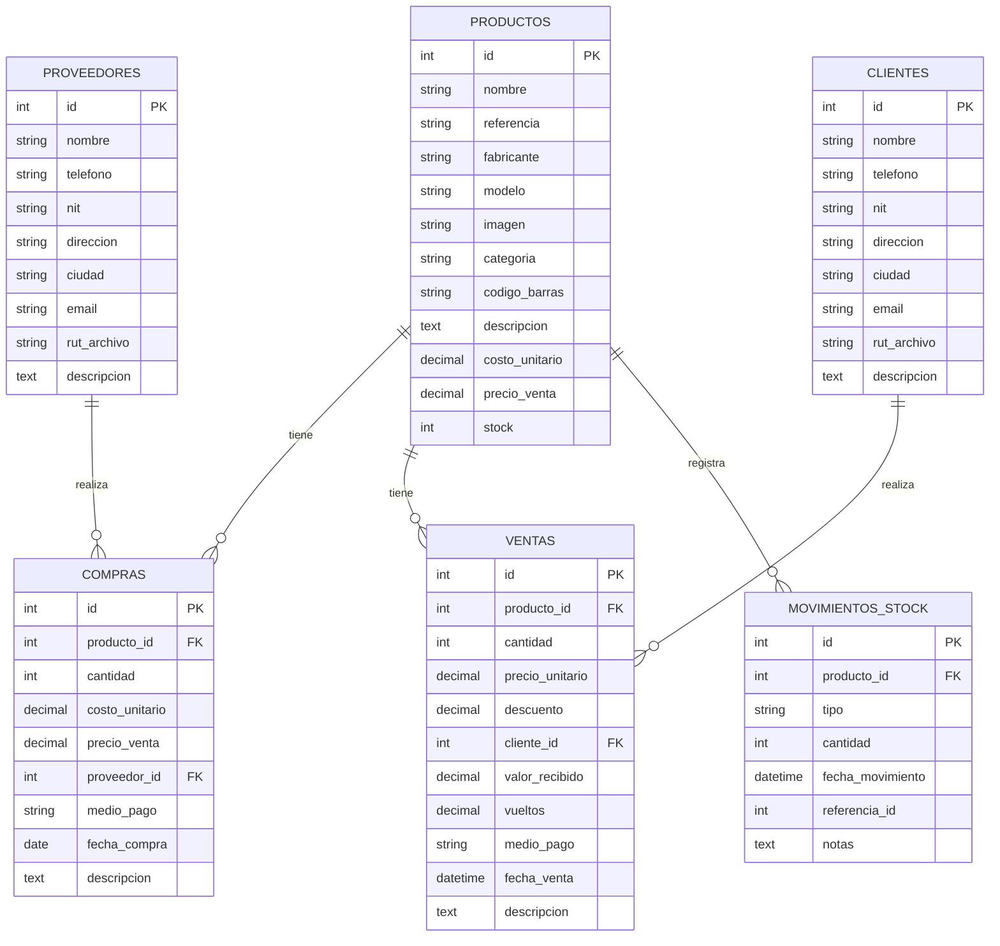

# JetXcel - Sistema de Gestión Comercial

## Descripción
JetXcel es un sistema de gestión comercial completo que permite administrar ventas, compras, inventario, clientes y proveedores. Desarrollado en PHP con una arquitectura MVC, proporciona una interfaz intuitiva para la gestión diaria de negocios.

## Características Principales

- 🛍️ Gestión de Productos
- 💰 Control de Ventas
- 📦 Gestión de Inventario
- 👥 Administración de Clientes
- 🏭 Gestión de Proveedores
- 📊 Reportes y Análisis
- 🔄 Control de Movimientos de Stock

## Requisitos del Sistema

- PHP 7.4 o superior
- MySQL 5.7 o superior
- Servidor web Apache con mod_rewrite habilitado
- Extensiones PHP requeridas: PDO, MySQLi, GD Library, JSON, cURL

## Instalación

1. Clonar el repositorio en el directorio de tu servidor web:
   ```bash
   git clone [URL_DEL_REPOSITORIO] /ruta/de/tu/servidor
   ```

2. Crear una base de datos MySQL y restaurar el archivo SQL:
   ```bash
   mysql -u usuario -p nombre_base_datos < /ruta/a/jetxcel_db.sql
   ```

3. Configurar los archivos de configuración:
   - Copiar `config/database.php.example` a `config/database.php`
   - Ajustar las credenciales de la base de datos

4. Configurar los permisos de los directorios:
   ```bash
   chmod -R 755 /ruta/de/tu/servidor/jetxcel2
   chmod -R 777 /ruta/de/tu/servidor/jetxcel2/public/uploads
   ```

5. Acceder a la aplicación a través de tu navegador:
   ```
   http://localhost/jetxcel2/public/
   ```

## Estructura del Proyecto

```
jetxcel2/
├── config/              # Archivos de configuración
├── public/             # Punto de entrada público
│   ├── assets/         # Archivos estáticos (CSS, JS, imágenes)
│   └── uploads/        # Archivos subidos por los usuarios
├── src/
│   ├── api/            # Endpoints de la API
│   ├── controllers/     # Controladores
│   ├── includes/       # Archivos incluidos
│   ├── models/         # Modelos de datos
│   └── views/          # Vistas
└── sql/                # Scripts de base de datos
```

## Base de Datos

### Diagrama de Entidad-Relación



## Uso

1. **Iniciar Sesión**
   - Accede al sistema con tus credenciales

2. **Gestión de Productos**
   - Agregar nuevos productos
   - Actualizar existencias
   - Gestionar categorías
   - Generar códigos de barras

3. **Ventas**
   - Procesar ventas rápidamente
   - Aplicar descuentos
   - Generar facturas
   - Gestionar métodos de pago

4. **Compras**
   - Registrar compras a proveedores
   - Actualizar inventario automáticamente
   - Seguimiento de pedidos

5. **Reportes**
   - Ventas por período
   - Productos más vendidos
   - Estado de inventario
   - Flujo de caja

## Contribución

1. Haz un fork del proyecto
2. Crea una rama para tu característica (`git checkout -b feature/nueva-funcionalidad`)
3. Haz commit de tus cambios (`git commit -am 'Añade nueva funcionalidad'`)
4. Haz push a la rama (`git push origin feature/nueva-funcionalidad`)
5. Abre un Pull Request

## Licencia

Este proyecto está bajo la Licencia MIT. Ver el archivo `LICENSE` para más detalles.

## Soporte

Para soporte, por favor contacte al equipo de desarrollo o abra un issue en el repositorio.

---

Desarrollado por [Tu Empresa] - 2025


+--------------+       +--------------+       +---------------+
|  productos   |       |  proveedores |       |   compras     |
+--------------+       +--------------+       +---------------+
| id (PK)      |<---+  | id (PK)      |<---+  | id (PK)       |
| nombre       |    |  | nombre       |    |  | producto_id   |
| referencia   |    |  | telefono     |    |  | cantidad      |
| fabricante   |    |  | nit          |    |  | costo_unitario|
| modelo       |    |  | direccion    |    |  | precio_venta  |
| imagen       |    |  | ciudad       |    |  | proveedor_id  |
| categoria    |    |  | email        |    |  | medio_pago    |
| codigo_barras|    |  | rut_archivo  |    |  | fecha_compra  |
| descripcion  |    |  | descripcion  |    |  | descripcion   |
| costo_unitario|    |  +--------------+    |  +---------------+
| precio_venta |    |                       |
| stock        |    |                       |
+--------------+    |                       |
                    |                       |
+--------------+    |                       |
|   clientes   |    |                       |
+--------------+    |                       |
| id (PK)      |<---+                       |
| nombre       |                            |
| telefono     |                            |
| nit          |                            |  +---------------+
| direccion    |                            |  |   ventas      |
| ciudad       |                            |  +---------------+
| email        |                            +--| id (PK)       |
| rut_archivo  |                            |  | producto_id   |
| descripcion  |                            |  | cantidad      |
+--------------+                            |  | precio_unitario|
                                            |  | descuento     |
                                            |  | cliente_id    |
                                            |  | valor_recibido|
                                            |  | vueltos       |
                                            |  | medio_pago    |
                                            |  | fecha_venta   |
                                            |  | descripcion   |
                                            |  +---------------+
                                            |
                                            |  +-------------------+
                                            |  | movimientos_stock |
                                            +--+ id (PK)           |
                                               | producto_id       |
                                               | tipo              |
                                               | cantidad          |
                                               | fecha_movimiento  |
                                               | referencia_id     |
                                               | notas             |
                                               +-------------------+
